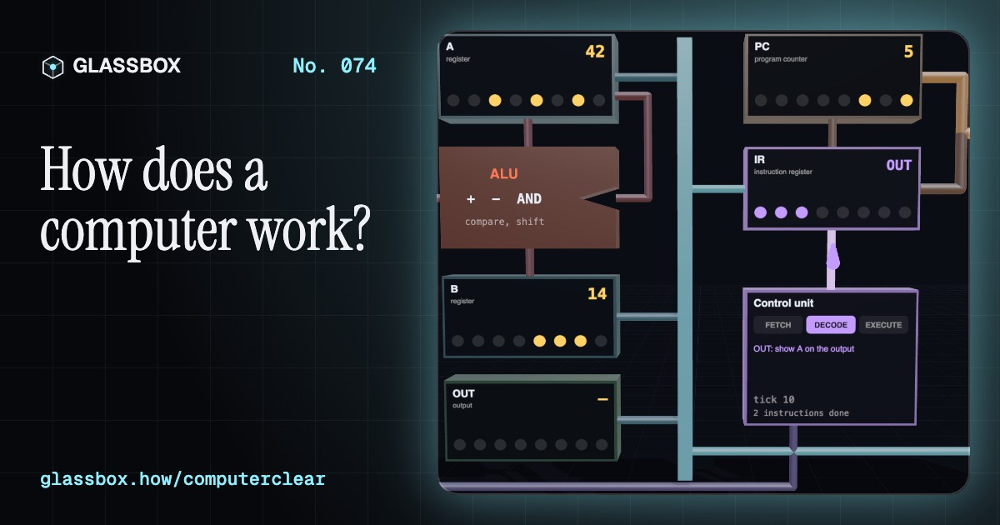
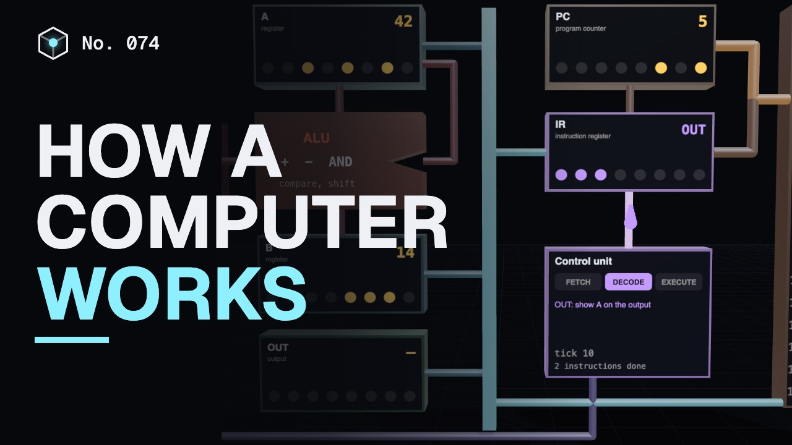
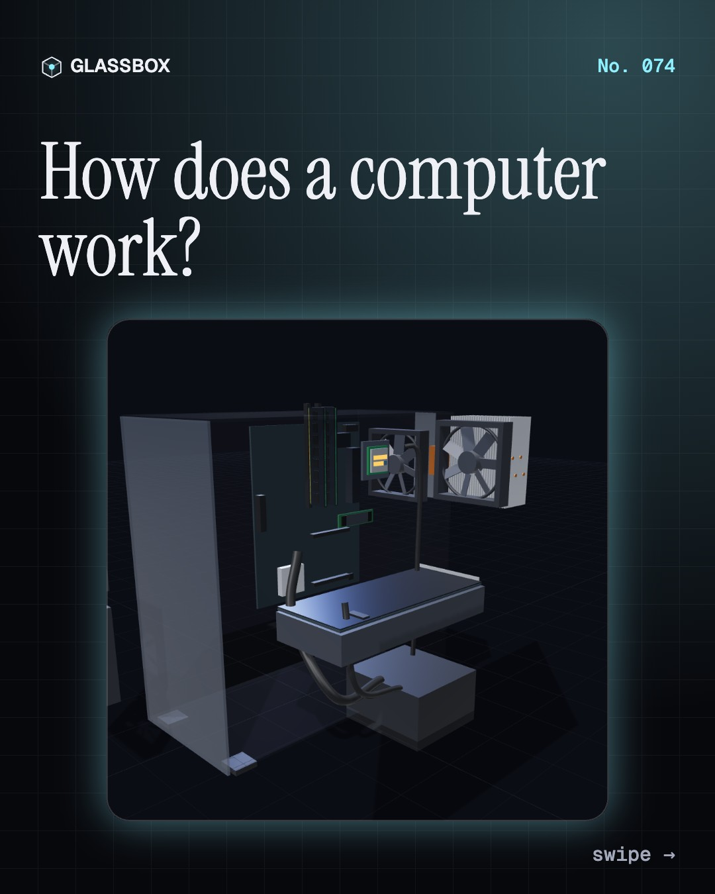
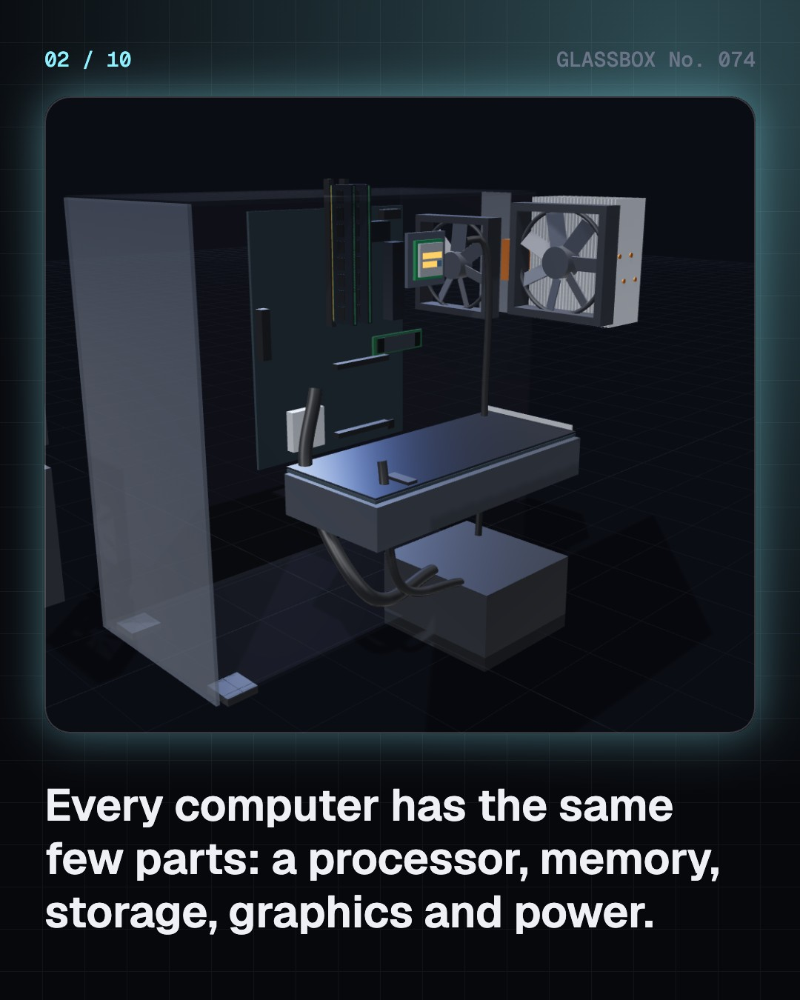
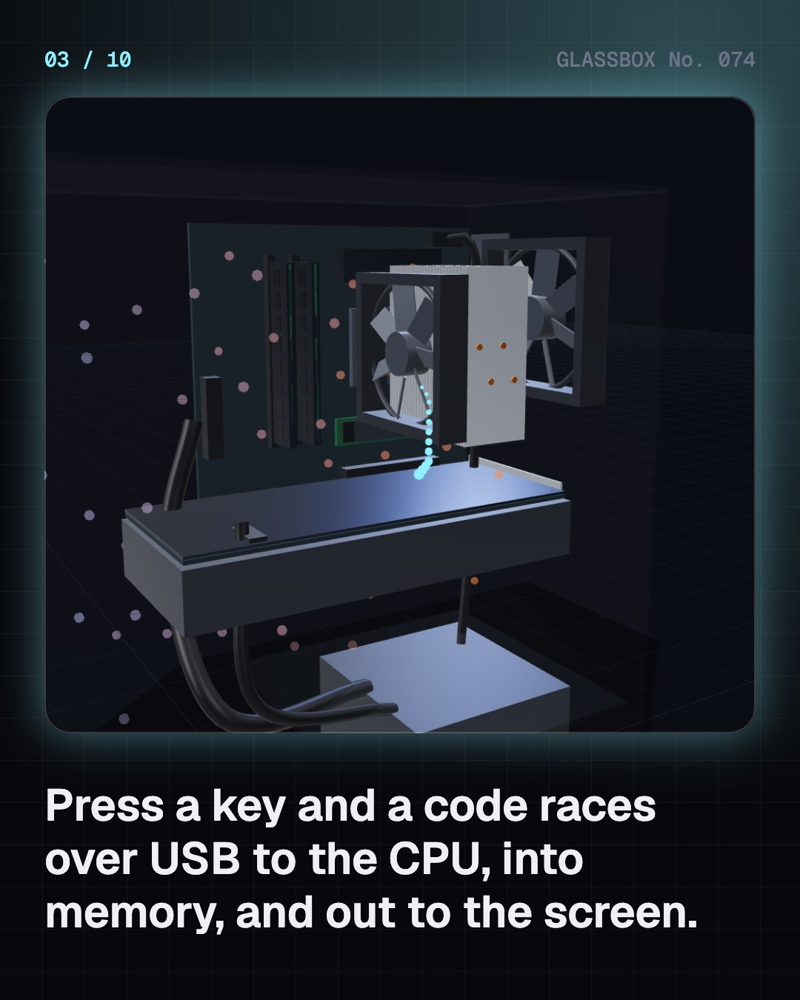
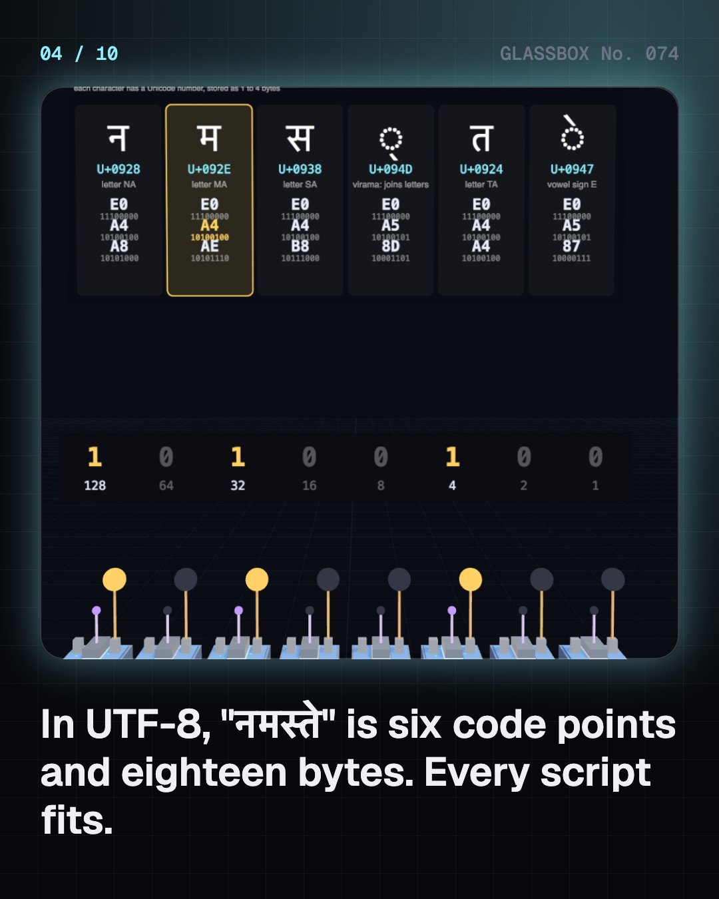

<!-- glassbox:start -->
<!-- Generated from glassbox.json by the Glassbox hub (npm run readme -- computerclear). Edit glassbox.json, not this block. -->
<p align="center"><a href="https://glassbox.how/e/computerclear/"></a></p>

<h1 align="center">ComputerClear</h1>

<p align="center"><b>How does a computer work?</b><br>A computer is billions of switches following a list of tiny instructions, one clock tick at a time. Take a desktop apart, type your name and see its bytes, and step a real 8-bit CPU through fetch, decode and execute.</p>

<p align="center"><a href="https://glassbox.how/computerclear/"><b>▶ Play with it</b></a> &nbsp;·&nbsp; <a href="https://glassbox.how/e/computerclear/">Read the 60-second explainer</a> &nbsp;·&nbsp; <a href="https://glassbox.how/computerclear/glassbox/reel.mp4">Watch the 40-second video</a></p>

<p align="center">
  <a href="https://glassbox.how/e/computerclear/"></a>
  <a href="https://glassbox.how/e/computerclear/"></a>
  <a href="LICENSE"></a>
  <a href="LICENSE-CONTENT.md"></a>
  <a href="#privacy"></a>
</p>

## In 60 seconds

1. **The same few parts.** Every computer has a processor (CPU) that follows instructions, fast working memory (RAM) that forgets when the power goes off, storage (an SSD) that keeps your files, a graphics chip for the screen, and a power supply, all joined by a circuit board's buses.
2. **Everything is ones and zeros.** A transistor is a switch: on is 1, off is 0. Eight bits make a byte, 256 patterns. A byte can mean a number, part of a letter (नमस्ते is 18 bytes in UTF-8), the brightness of red, green or blue, or one sample of a sound.
3. **Fetch, decode, execute.** A CPU loops three steps: fetch the next instruction from memory using the program counter, decode what it means, and execute it by steering data through the ALU and registers. A real core does this billions of times a second, on 8 to 24 cores.
4. **Near and fast, far and slow.** Registers answer at once, the L1 cache in about a nanosecond, RAM in about 100 ns, the SSD in tens of microseconds. If a clock tick took one second, reaching RAM would take nearly seven minutes, so caches keep recently used data close by.
5. **Code becomes machine code.** A compiler turns lines people can read into the numbered instructions a CPU runs. The operating system shares the cores between apps a few milliseconds at a time, and at power-on firmware loads a boot loader, which loads the OS.
6. **From a room to a pocket.** ENIAC filled a room and added 5,000 numbers a second on 150 kW. Transistors, then chips, doubled in number about every two years: from 2,300 in 1971 to over 200 billion today. India built TIFRAC in 1960 and PARAM in 1991, and now runs billions of UPI payments a month.

## Words worth knowing

| Term | Meaning |
|---|---|
| **CPU** | The processor: the chip that fetches, decodes and executes a program's instructions. |
| **Transistor** | A tiny silicon switch, turned on or off by a voltage on its gate. |
| **Byte** | Eight bits, which can stand for any number from 0 to 255. |
| **UTF-8** | The common way to store Unicode text, using 1 to 4 bytes per character. |
| **Program counter** | The register that holds the address of the next instruction. |
| **ALU** | Arithmetic logic unit: the part of the CPU that adds, subtracts and compares. |
| **Clock speed** | How many steps a CPU takes each second; 4 GHz is 4 billion ticks a second. |
| **Cache** | A small, fast memory that keeps copies of recently used data close to the CPU. |
| **Compiler** | A program that translates source code into machine code. |
| **Operating system** | The master program that runs the hardware and shares it between apps. |

## A short history

**From pebbles on a counting board to billions of switches on a chip: 4,500 years of teaching machines to follow instructions.**

- **1822** · Babbage's engines (Charles Babbage, London)
- **1843** · Ada Lovelace writes the first published program (Ada Lovelace, London)
- **1936** · Turing imagines a universal machine (Alan Turing, Cambridge)
- **1945** · ENIAC, the giant electronic brain (J. Presper Eckert and John Mauchly, University of Pennsylvania, Philadelphia)
- **1945** · The stored-program idea (John von Neumann, with the ENIAC team, Moore School, Philadelphia)
- **1947** · The transistor (John Bardeen, Walter Brattain and William Shockley, Bell Labs, Murray Hill, New Jersey)
- **1958** · The integrated circuit (Jack Kilby (Texas Instruments) and Robert Noyce (Fairchild), Dallas, Texas and Mountain View, California)
- **1960** · TIFRAC, India's first computer (Rangaswamy Narasimhan and team, TIFR, Bombay (now Mumbai))

The full story, with 30 moments, charts, people and 40 sources: [glassbox.how/e/computerclear/history](https://glassbox.how/e/computerclear/history/). The data lives in [`history.json`](history.json).

## Video and slides

Made with the Glassbox studio from this box's storyboard (`window.glassbox.director`). Free to reuse under CC BY 4.0.

<a href="https://glassbox.how/computerclear/glassbox/video.mp4"></a>

<p><a href="glassbox/slide-1.jpg"></a> <a href="glassbox/slide-2.jpg"></a> <a href="glassbox/slide-3.jpg"></a> <a href="glassbox/slide-4.jpg"></a></p>

| File | What | Size |
|---|---|---|
| [`glassbox/reel.mp4`](https://glassbox.how/computerclear/glassbox/reel.mp4) | Reel / Short, with captions and soundtrack | 1080×1920 |
| [`glassbox/video.mp4`](https://glassbox.how/computerclear/glassbox/video.mp4) | YouTube video, with captions and soundtrack | 1920×1080 |
| `glassbox/slide-1…10.jpg` | Instagram carousel | 1080×1350 |
| `glassbox/thumb.jpg` | YouTube thumbnail | 1280×720 |
| `glassbox/cover.jpg` | Share card and repo social preview | 1200×630 |
| [`glassbox/history-reel.mp4`](https://glassbox.how/computerclear/glassbox/history-reel.mp4) | “History in 10 moments” Reel / Short | 1080×1920 |
| `glassbox/history-slide-*.jpg` | History carousel | 1080×1350 |
| `glassbox/post.json` | Post copy and schedule used by the publish kit | |

## Privacy

This box has no accounts and no ads, and it ships its own fonts and libraries. When you run it yourself it sends nothing anywhere. On glassbox.how, the site's `/bar.js` also loads Glassbox's analytics: **Google Analytics** to count visits (it asks first in the EU, UK and Switzerland, and stays off when your browser sends Global Privacy Control or Do Not Track) and **ClickTrust** to detect bots.

It remembers a few things **in your own browser only**, and never sends them anywhere:

| Browser storage key | What it holds |
|---|---|
| `computerclear.v1` | Which chapters you have opened, your best quiz scores, and sound on or off. |

Exactly what each one sees is at [glassbox.how/privacy](https://glassbox.how/privacy/).

## Licences

- **Code:** [MIT](LICENSE). Use it, change it, ship it.
- **Explanations, text, images and videos** (`glassbox.json`, `glassbox/`): [CC BY 4.0](LICENSE-CONTENT.md). Credit “Glassbox, glassbox.how/e/computerclear”.
- **Third-party parts** keep their own licences: [three.js](https://threejs.org) (MIT), [Geist, Instrument Serif](https://openfontlicense.org) (SIL OFL 1.1).
- The Glassbox name and logo aren't covered by either licence. See the [terms](https://glassbox.how/terms/).

Found a mistake? [Open an issue](https://github.com/bdeeps/computerclear/issues). Corrections happen in public.
<!-- glassbox:end -->

## Run it

It's plain HTML, CSS and JavaScript. No build step and no dependencies. Run locally, it contacts no other website.

```bash
python3 -m http.server 8000
```

Three.js and the fonts ship in `vendor/` and `fonts/`, so it also works offline.

Then open http://localhost:8000.

## How it's built

| File | What |
|---|---|
| `index.html`, `css/app.css` | The page and its styles |
| `js/app.js`, `js/stage.js`, `js/ui.js`, `js/kit.js` | The shared Glassbox 3D engine: chapters, 3D stage, controls, quiz, video director |
| `js/computer.js` | Shared parts: TOY-8, a tiny 8-bit computer with a documented 16-instruction set, its assembler and a small compiler; UTF-8 encoding, a cache simulator, sourced latency figures, canvas boards, and the generic desktop PC model |
| `js/chapters/*.js` | One file per chapter: the 3D model, controls, text, key terms, quiz and video scenes |
| `glassbox.json` | Title, question, explainer beats, key terms, browser storage and credits shown on glassbox.how |
| `reel` in each chapter | The storyboard the Glassbox studio records into short videos |
| `glassbox/` | The published video, slides, thumbnail and post copy |
| `fonts/`, `vendor/three/` | Self-hosted Geist and Instrument Serif (SIL OFL 1.1) and three.js (MIT) |
